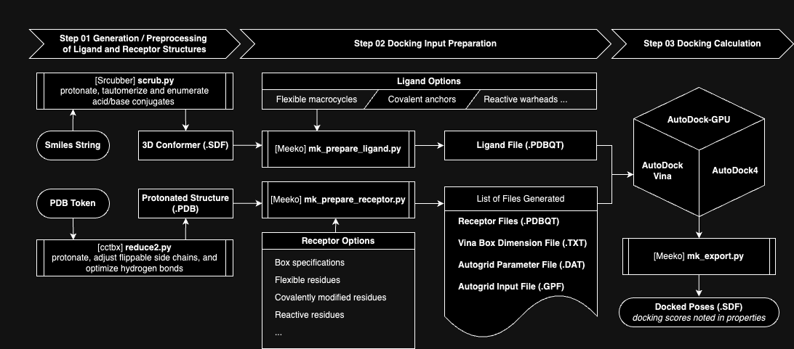

# Colabs
My repository of Google Colab notebooks



```
├── Compiled_for_Colab
│   ├── AutoDock-GPU_v1.5.3
│   │   ├── 091624_Compile_ADGPU_v153.ipynb
│   │   ├── adgpu_analysis
│   │   └── autodock_gpu_128wi
│   └── AutoGird_v4.2.6
│       ├── 091624_Compile_AutoGrid.ipynb
│       └── autogrid4
├── Meeko_RTD_Examples
│   ├── 01_Covalent_Docking
│   │   ├── 091724_Meeko_covalent_docking.ipynb
│   │   └── output.zip
│   └── 02_Reactive_Docking
│       ├── 091724_Meeko_reactive_docking.ipynb
│       └── output.zip
├── Vina_RTD_Examples
│   ├── 01_Basic_Docking
│   │   ├── Vina_RTD_01_Basic_Docking.ipynb
│   │   └── output.zip
│   ├── 02_Flexible_Docking
│   │   ├── Vina_RTD_02_Flexible_Docking.ipynb
│   │   └── output.zip
│   ├── 03_Using_AD4SF
│   │   ├── Vina_RTD_03_Docking_with_AD4SF.ipynb
│   │   └── output.zip
│   ├── 04_RNA-Small_Molecule_Basic_Docking
│   │   ├── Vina_04_RNA_Small_Molecule_Basic_Docking.ipynb
│   │   └── output.zip
│   └── 05_Basic_Docking_with_Cofactors
│       ├── Vina_05_Basic_Docking_with_Cofactor_in_Receptor.ipynb
│       └── output.zip
```

## Compiled_for_Colab
### AutoDock-GPU_v1.5.3
 <a href="https://colab.research.google.com/drive/1ctEm2Z0XKk_rA3PwfF1OpIh1kSPkHC_l?usp=sharing">091624_Compile_ADGPU_v153.ipynb</a>

### AutoGrid_v4.2.6
 <a href="https://colab.research.google.com/drive/1XawsbDVut9nA3Y8byS1jwnzubHDJQAR9?usp=sharing">091624_Compile_AutoGrid.ipynb</a>


## Vina_RTD_Examples
### 01_Basic_Docking
 <a href="https://colab.research.google.com/drive/1cHSl78lBPUc_J1IZxLgN4GwD_ADmohVU?usp=sharing">Vina_RTD_01_Basic_Docking.ipynb</a>

### 02_Flexible_Docking
 <a href="https://colab.research.google.com/drive/1cazEckGbvl9huWzpxXpd_Qaj0_NipWcz?usp=sharing">Vina_RTD_02_Flexible_Dockingb</a>

### 03_Using_AD4SF
 <a href="https://colab.research.google.com/drive/1zoSyID2fSoqGz3Zb1_IatUT2uxZ2mCNZ?usp=sharing">Vina_RTD_03_Docking_with_AD4SF.ipynb</a>

### 04_RNA-Small_Molecule_Basic_Docking
 <a href="https://colab.research.google.com/drive/1hkt-XYebvAvbAf3cxZ3Yfze5R2lzhUfO?usp=sharing">Vina_04_RNA_Small_Molecule_Basic_Docking.ipynb</a>

### 05_Basic_Docking_with_Cofactors
 <a href="https://colab.research.google.com/drive/1-2yoPRVsmrLoYzLQGi_3KGWLlRk7ETdn?usp=sharing">Vina_05_Basic_Docking_with_Cofactor_in_Receptor.ipynb</a>

## Meeko_RTD_Examples
### 01_Covalent_Docking
 <a href="https://colab.research.google.com/drive/1tf9xOgn6u8eDTeFJtc8GCEGRX-8aR9Bo?usp=sharing">091724_Meeko_covalent_docking.ipynb</a>

 ### 02_Reactive_Docking
  <a href="https://colab.research.google.com/drive/1tzQoguVQDCguOaLSsGvQuL57ry_PY3UG?usp=sharing">091724_Meeko_reactive_docking.ipynb</a>
